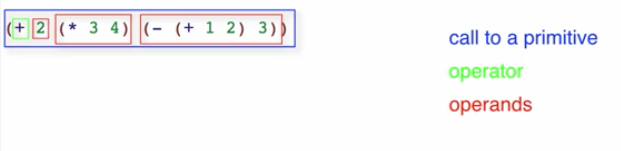

# Beginning Student Language
Изучаются основы языка (примитивы, выражения, функции) и среда разработки (DrRacket).

## Expressions
Выражения:

```lisp
<value> ; значение — выражение, возвращающее себя
(<primitive> <expression> ...)
```

> Let me say a word here about math. The Pythagorean theorem here is pretty much the hardest math we're going to do in this whole course. And that's important because you need to know that to design a lot of programs, you don't need to know a lot of math. You can be a very good program designer without knowing a lot of math.

Если взять `(sqrt 2)`, по мы получим `#i1.4142135623730951`. Префикс `#i` говорит, что это неточное число (inexact number). То есть оно близкое, но не точное. В ЭВМ нельзя хранить бесконечные числа (память ограничена), поэтому это вот такое представление.

:::tip Объяснялочка
Нужно найти среднее арифметическое чисел `4`, `6.2` и `-12`. Все выражения дают одни и тот же результат. Какое из них лучше всего записать в программе?

- `(/ (+ 4 6.2 -12) 3)`
- `(/ (+ -8 6.2) 3)`
- `-0.6`
- Не важно, все одинаковые

Правильным будет первое, потому что так сразу видно, что здесь вычисляется среднее арифметическое.
:::

## Evaluation


Чтобы вычислить вызов примитивного оператора, нужно:

- привести операнды к значениям (вычислить их, если они выражения, а не значения)
- применить оператор к этим значениям

Таким образом, вычисление происходит слева-направо, изнутри-наружу.

## Strings and Images
Строки и картинки — примитивы в Racket.

```lisp
"123" ; строка
123   ; число
(+ 1 "123") ; ошибка

(string-append "Ada" " " "Lovelace") ; встроенная функция, соединяет строки
(string-length "localhost") ; 9, длина строки
(substring "localhost" 5 9) ; индекс начала от 0, индекс конца (не включая)
```

:::tip Объяснялочка
Zero-based indexing: чтобы лучше понять, какие индексы использовать в функции `substring` можно разместить строку с числами от 0 поверх строки, к которой нужно применить функцию:

```lisp
         ; "012345678"
(substring "localhost" 5 9) ; "host"
```
:::

Чтобы начать юзать картинки, нужно импортировать в Ракет [соответствующий модуль](https://docs.racket-lang.org/teachpack/2htdpimage-guide.html):

```lisp
(require 2htdp/image)

(beside (circle 10 "outline" "blue")
        (rectangle 100 20 "solid" "red")
        (text "hello" 24 "orange"))

; Знак СТОП
(overlay (text "STOP" 48 "white") 
         (regular-polygon 60 8 "solid" "red"))
```

- `2htdp` — значит второе издание книги How to Design Programs.
- `above` возвращает стэк картинок — одна под другой, сверху вниз, с выравниванием по центру.
- `beside` — то же самое, но одна-за-другой (в линию).
- `overlay` — одна-над-другой, выравнивание по центу, первая будет над всеми.

## Constant Definitions
:::tip Хозяйке на заметку
...and that those two properties — **readability** and **changeabiliy** — are two of the most important properties a program can have.
:::

Объявление константы:

```lisp
(define WIDTH 400) ; (define <name> <expression>)
```

## Function Definitions
Функции позволяют избавится от повторения и делают код выразительнее (короче, понятнее):

```lisp
; Было
(above (circle 40 "solid" "red")         
       (circle 40 "solid" "yellow")
       (circle 40 "solid" "green"))

; Стало
(define (bulb color)
    (circle 40 "solid" color))

(above (bulb "red")         
       (bulb "yellow")
       (bulb "green"))
```

Нужно только правильно выбирать имена.

Определение функции:

```lisp
(define (<func-name> <param-name> ...)
    <expression>)
```

Вызов:

```lisp
(func-name <expression> ...) ; expression — операнд
```

## Booleans and if Expressions
Предикат — примитив, выражение или функция, которая возвращает булево значение. Примеры предикатов из Ракета:

- `=`
- `string=?`
- `<`, `>`, `<=`, `>=`

```lisp
(define WIDTH 100)
(define HEIGHT 100)
(> WIDTH HEIGHT)  ; #false
(>= WIDTH HEIGHT) ; #true
(string=? "foo" "bar") ; #false, встроенная функция
```

Пример с картинками:

```lisp
(require 2htdp/image)

(define I1 (rectangle 10 20 "solid" "red"))
(define I2 (rectangle 20 10 "solid" "blue"))

(< (image-width I1) (image-width I2)) ; встроенная функция
```

`if`-выражение (if expression):

```lisp
(if <expression>  ; предикат
    <expression>  ; если true
    <expression>) ; если false
```

Пример:

```lisp
(if (< (image-width I1) (image-height I1))
    "tall"
    "wide")
```

Порядок вычислений: сначала предикат, потом заменить весь иф на выражение для тру или фолс.

Несколько условий можно вычислять с помощью `and`:

```lisp
; (and <expression> ...)
(and (< (image-width I1) (image-height I2))
     (> (image-height I1) (image-width I2)))
```

Если одно из выражение вычисляется в `false`, то `and` немедленно возвращает `false`. Если все возвращают `true`, то все выражение `and` вернет `true`.

Есть еще `or` и `not`.

## Using the Stepper
Степпер позволяет увидеть пошаговое выполнение выражений.

## Discovering Primitives
Во-первых, можно просто попытаться угадывать название примитивов (встроенных функций и операторов).

На примитив можно ткнуть правой кнопкой и выбрать поиск по документации.

Еще можно открыть документацию по оператору и там будут related-операторы. Например, открыв описание `/` можно найти больше, меньше, абсолютное значение и пр.


