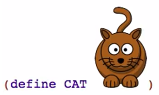

# 1a: Beginning Student Language
Изучаются основы языка (примитивы, выражения, функции) и среда разработки (DrRacket).

## Expressions
Выражения:

```lisp
<value> ; значение — выражение, возвращающее себя
(<primitive> <expression> ...)
```

> Let me say a word here about math. The Pythagorean theorem here is pretty much the hardest math we're going to do in this whole course. And that's important because you need to know that to design a lot of programs, you don't need to know a lot of math. You can be a very good program designer without knowing a lot of math.

Если взять `(sqrt 2)`, по мы получим `#i1.4142135623730951`. Префикс `#i` говорит, что это неточное число (inexact number). То есть оно близкое, но не точное. В ЭВМ нельзя хранить бесконечные числа (память ограничена), поэтому это вот такое представление.

:::tip Объяснялочка
Нужно найти среднее арифметическое чисел `4`, `6.2` и `-12`. Все выражения дают одни и тот же результат. Какое из них лучше всего записать в программе?

- `(/ (+ 4 6.2 -12) 3)`
- `(/ (+ -8 6.2) 3)`
- `-0.6`
- Не важно, все одинаковые

Правильным будет первое, потому что так сразу видно, что здесь вычисляется среднее арифметическое.
:::

## Evaluation


Чтобы вычислить вызов примитивного оператора, нужно:

- привести операнды к значениям (вычислить их, если они выражения, а не значения)
- применить оператор к этим значениям

Таким образом, _вычисление происходит слева-направо, изнутри-наружу_.

## Strings and Images
Строки и картинки — примитивы в Racket.

```scheme
"123" ; строка
123   ; число
(+ 1 "123") ; ошибка

(string-append "Ada" " " "Lovelace") ; встроенная функция, соединяет строки
(string-length "localhost") ; 9, длина строки
(substring "localhost" 5 9) ; индекс начала от 0, индекс конца (не включая)
```

:::tip Объяснялочка
Zero-based indexing: чтобы лучше понять, какие индексы использовать в функции `substring` можно разместить строку с числами от 0 поверх строки, к которой нужно применить функцию:

```scheme
         ; "012345678"
(substring "localhost" 5 9) ; "host"
```
:::

Чтобы начать юзать картинки, нужно импортировать в Ракет [соответствующий модуль](https://docs.racket-lang.org/teachpack/2htdpimage-guide.html):

```scheme
(require 2htdp/image)

(beside (circle 10 "outline" "blue")
        (rectangle 100 20 "solid" "red")
        (text "hello" 24 "orange"))

; Знак СТОП
(overlay (text "STOP" 48 "white") 
         (regular-polygon 60 8 "solid" "red"))
```

- `2htdp` — значит второе издание книги How to Design Programs.
- `above` возвращает стэк картинок — одна под другой, сверху вниз, с выравниванием по центру.
- `beside` — то же самое, но одна-за-другой (в линию).
- `overlay` — одна-над-другой, выравнивание по центу, первая будет над всеми.

> In Racket images are values and all values are expressions.

Картинка — примитив. Можно вставлять прямо в код:



## Constant Definitions
:::tip Хорошие абстракции — хорошая программа
...and that those two properties — **readability** and **changeabiliy** — are two of the most important properties a program can have.
:::

Объявление константы:

```scheme
(define WIDTH 400) ; (define <name> <expression>)
```

Мутаций нет. Константа — это константа: один раз объявили, дали имя и все. Если передавать ее в функции, то функции будут возвращать новое значение не мутируя константу-аргумент.

## Function Definitions
Константы всегда одинаковы. Функции позволяют возвращать разные значения с разными аргументами.

Функции позволяют избавится от повторения и делают код выразительнее (короче, понятнее). Нужно только правильно выбирать имена:

```scheme
; Было: рисуем три каких-то круга разных цветов.
; Код избыточен, много ненужных повторений (меняется только цвет).
(above (circle 40 "solid" "red")         
       (circle 40 "solid" "yellow")
       (circle 40 "solid" "green"))

; Повышаем уровень абстракции, добавив функцию `bulb`.
(define (bulb color)
    (circle 40 "solid" color))

; Стало: рисуем три лампочки разных цветов.
(above (bulb "red")         
       (bulb "yellow")
       (bulb "green"))
```

Повысив уровень абстракции (вынеся код в функцию) мы добились большей осмысленности кода — теперь ясно, что мы рисуем не просто круги, а лампочки светофора. Также мы повысили изменяемость кода (changeability): теперь реализацию лампочек можно менять как нам угодно, не затрагивая основную программу (делать рефакторинг).

Определение функции:

```lisp
(define (<func-name> <param-name> ...)
    <expression>)
```

Вызов:

```lisp
(func-name <expression> ...) ; expression — операнд
```

## Booleans and if Expressions
Предикат — то, что возвращает булево значение (примитив, выражение или функция). Примеры предикатов из Ракета:

- `=` — примитив для сравнения на равенство.
- `string=?` — примитив для определения строки.
- `<`, `>`, `<=`, `>=` — примитивы для сравнения цифровых значений.

```scheme
(define WIDTH 100)
(define HEIGHT 100)
(> WIDTH HEIGHT)  ; false
(>= WIDTH HEIGHT) ; true
(string=? "foo" "bar") ; false, встроенная функция
```

Пример с картинками:

```scheme
(require 2htdp/image)

(define I1 (rectangle 10 20 "solid" "red"))
(define I2 (rectangle 20 10 "solid" "blue"))

(< (image-width I1) (image-width I2)) ; встроенная функция
```

`if`-выражение (if expression):

```lisp
(if <expression>  ; предикат
    <expression>  ; выполнить, если предикат — true
    <expression>) ; выполнить, если предикат — false
```

Пример:

```scheme
; Картинка высокая или широкая?
(if (< (image-width I1) (image-height I1)) ; вопрос
    "tall"                                 ; ответ — true
    "wide")                                ; ответ — false
```

Порядок вычисления `if`-выражения:

1. Вычислить предикат.
2. Заменить весь `if` на выражение для `true` или для `false`.

Несколько условий можно вычислять с помощью `and`:

```scheme
; (and <expression> ...)
(and (< (image-height I1) (image-height I2)) ; I1 ниже I2?
     (> (image-width I1) (image-width I2)))  ; I1 шире I2?
```

Если одно из выражение вычисляется в `false`, то `and` немедленно возвращает `false`. Если все возвращают `true`, то все выражение `and` вернет `true`.

Есть еще `or` и `not`.

## Using the Stepper
Степпер позволяет увидеть пошаговое выполнение выражений. Просто нажать `Step` справа вверху.

## Discovering Primitives
Во-первых, можно **просто** попытаться **угадывать** название примитивов (встроенных функций и операторов).

На примитив в редакторе можно ткнуть правой кнопкой и выбрать поиск по документации (search helpdesk).

Во-вторых, можно открыть документацию по оператору и поскроллить-посмотреть похожие операторы. Например, открыв описание для оператора деления ([`/`](https://docs.racket-lang.org/reference/generic-numbers.html#%28def._%28%28quote._~23~25kernel%29._%2F%29%29)) можно найти округление ([`round`](https://docs.racket-lang.org/reference/generic-numbers.html#%28def._%28%28quote._~23~25kernel%29._round%29%29)), абсолютное значение ([`abs`](https://docs.racket-lang.org/reference/generic-numbers.html#%28def._%28%28quote._~23~25kernel%29._abs%29%29)) и пр.

