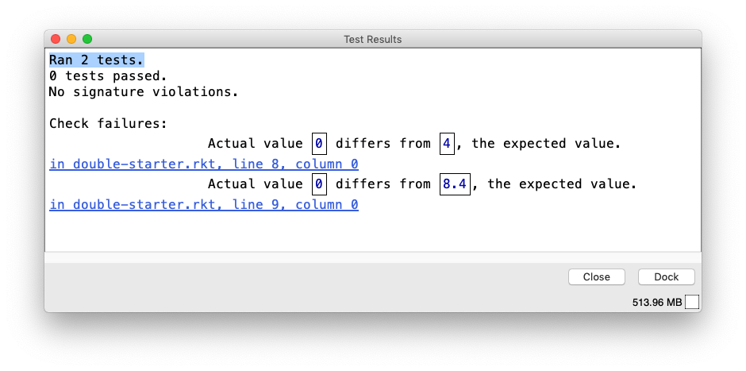
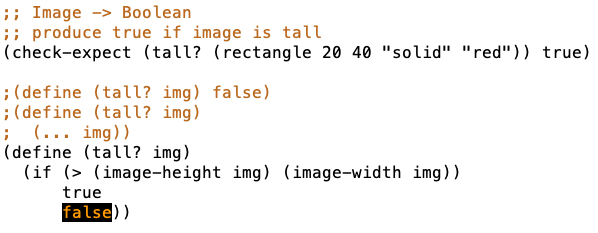

# 1b: How to Design Functions
Что значит дизайн:

> Design is the process of going from a poorly formed problem to a well structured solution.

## Module Overview
Цель модуля:

- Научиться применять рецепт для создания функций, оперирующих простыми данными;
- Научиться читать функции и разбирать разные элементы их дизайна;
- Научиться проверять разные элементы функции на доступность, простоту, ясность и консистентность;
- Научиться определять, на сколько рецепт, по которому написана функция, решает задачу.

In English:

- Be able to use the How to Design Functions (HtDF) recipe to design functions that operate on primitive data.
- Be able to read a complete function design and identify its different elements.
- Be able to evaluate the different elements for clarity, simplicity and consistency with each other.
- Be able to evaluate the entire design for how well it solves the given problem.

## HtDF Recipe
Рецепт помогает составить правильное представление о функции, которую нужно записать в виде кода. Его не нужно запоминать, но нужно научиться им пользоваться как руководством при проектировании функций. И выработать привычку к написанию продуманного кода.

Рецепт нужен для того, чтобы раздробить большую задачу на несколько мелких и дать четкие пошаговые рекомендации. Это очень хорошо для начинающих.

Совсем простые функции с использованием рецепта выглядят натянутыми, зато сложные функции с использованием рецепта написать проще и результат будет качественнее.

Рецепт состоит из следующих шагов:

1. Сигнатура, назначение, заглушка (Signature, purpose and stub).
2. Примеры-тесты (define examples, wrap each in `(check-expect ...)`).
3. Шаблон (Template and inventory).
4. Тело функции (Code the function body).
5. Тестирование и исправление (Test and debug until correct).

:::tip Объяснялочка
Термины «аргумент», «параметр» и «входящее значение» в тексте ниже можно считать эквивалентными.

Если посмотреть на вопрос по-задротски, то параметры функции — это переменные, используемые в объявлении функции. Аргументы — это реальные значения, которые передаются в функцию при её вызове:

```scheme
(define (double n) ; n - параметр
    (* n 2))
(double 4)         ; 4 - аргумент
```
:::

### 1. Сигнатура, назначение, заглушка
Для примера рассмотрим такую задачу:

> Design a function that consumes a number and produces twice that number. Call your function double. Follow the HTdF recipe and show the stub and template.

То есть нужно написать простую функцию, которая принимает значение и возвращает его умноженным на 2.

#### Сигнатура
Здесь сигнатура функции — это тип данных, которые функция принимает и тип данных возвращаемого значения. Типы данных указываются с большой буквы, возвращаемый тип указывается после стрелки.

У функции из примера сигнатура будет такая:

```scheme
;; Number -> Number
```

Если аргументов несколько, то указываются все их типы через запятую до стрелки:

```scheme
;; Number, Number, Bool -> Number
```

Это первая строка.

#### Назначение
Назначение (purpose, цель, описание) — краткое, _однострочное_ описание того, что функция возвращает с учетом того, что она принимает. Назначение расширяет сигнатуру, добавляет в нее смысл. Сигнатура говорит о типе значений, а назначение говорит, что мы должны получить из входных параметров.

Например, наша функция возвращает аргумент, умноженный на два:

```scheme
;; produce 2 times the given number
```

Назначение «принимает число и возвращает число» — плохое, оно дублирует сигнатуру. Нужно конкретно указывать, что именно будет возвращено и что за параметры приходят. Например, если нужно посчитать площадь квадрата по его стороне, то можно написать такое назначение:

```scheme
;; Number -> Number
;; Принимает длину стороны квадрата, возвращает его площадь.
```

То есть назначение _придает смысл типам, обозначенным в сигнатуре_.

Важно записать назначение в одну строку. Иногда это бывает сложно, но усилия на формулировку однострочного назначения позволят лучше понять, что должна выполнять функция.


Сигнатура и назначение всегда остаются в комментарии перед функцией:

```scheme
;; Number -> Number
;; produce 2 times the given number
```

#### Заглушка
Заглушка (stub) — это временный код, псевдореализация с фейковым возвращаемым значением. Заглушка позволяет убедится, что тесты, которые мы добавим на следующем шаге, запускаются.

Заглушка должна иметь правильное имя функции, принимать нужное число параметров, возвращать заглушечный результат нужного типа (например, `0` для чисел, `true` для булевых значений и т.д.):

```scheme
;; Number -> Number                      ; сигнатура
;; produce 2 times the given number      ; назначение

(define (double n)  0)                   ; заглушка
```

### 2. Примеры-тесты
Примеры-тесты — это вызовы нашей функции с реальными значениями, результат которых проверяется функцией [`(check-expect ...)`](https://docs.racket-lang.org/htdp-langs/beginner.html#%28form._%28%28lib._lang%2Fhtdp-beginner..rkt%29._check-expect%29%29). Таким образом примеры и тесты в Racket работают вместе.

Примеры-тесты вставляются перед заглушкой:

```scheme
;; Number -> Number                      ; сигнатура
;; produce 2 times the given number      ; назначение
(check-expect (double 2) 4)              ; пример-тест
(check-expect (double 4.2) 8.4)          ; пример-тест

(define (double n)  0)                   ; заглушка
```

Запускаем — тесты провалятся т.к. сейчас наша функция всегда возвращает `0`. Зато мы увидим, выполнились ли все тесты. Если выполнились, значит мы их написали верно и можно идти дальше. Тут выполнились 2 теста, все ок:



Если не все тесты выполнились и упали, начит в каких-то из них есть ошибки, которые нужно исправить.

Важно убедиться, что тесты написаны хорошо как можно раньше (выполняются с заглушкой и падают), перед реализацией самой функции. Потому что если в тест закралась ошибка (не выполнится при запуске с заглушкой), то при работе над более сложной функцией можно потерять много времени.

Имея под рукой примеры и тесты, функцию проще реализовать. Становится понятнее, как она должна себя вести, какое значение должна возвращать в зависимости от аргументов, какой у нее должен быть синтаксис. Об этом можно будет не думать на этапе работы с телом функции, где задачи уже будут алгоритмические.

В примерах-тестах нужно использовать разные аргументы. Например, если функция принимает число, то числа могут быть отрицательными, десятичными дробями, нулем и т.д.

Если сигнатуры верные, типы ожидаемых и возвращаемых величин совпадают. Это важно, потому что в сложных функциях вероятность допустить ошибки в тестах возрастает.

Как только тесты проверены, заглушку можно закоментить (далее по курсу она удаляется).

:::tip Объяснялочка
Каждый записанный по рецепту шаг помогает записать следующий. Например, сигнатура помогает написать назначение и заглушку, потому что указывает типы и количество принимаемых значений и тип возвращаемого значения.

По сигнатуре видно, что наша функция принимает число и возвращает число. Значит в назначении нужно указать, чем является это за число, а в заглушке использовать что-то, что является числом в качестве возвращаемого значения (`0` в нашем случае). И т.д.
:::

### 3. Шаблон
Тело шаблона — набросок функции (outline), который будет использован как основа для финальной функции:

```scheme
(define (double n)
    (... n))        ; функция делает "что-то" с `n`
```

> The template is really trying to tell you: hey, here's the stuff you have to work with.

После 3-го шага получим:

```scheme
;; Number -> Number                      ; сигнатура
;; produce 2 times the given number      ; назначение
(check-expect (double 2) 4)              ; пример-тест
(check-expect (double 4.2) 8.4)          ; пример-тест

;(define (double n)  0)                  ; заглушка
(define (double n)                       ; шаблон
    (... n))
```

### 4. Тело функции
Копируем шаблон и вместо `...` пишем реализацию. Сам шаблон комментируем (далее по курсу его можно будет удалять, но для начала рекомендуется оставить перед глазами). Используем все, что узнали и записали на предыдущих шагах.

Помогает разбор записанных примеров. Нужно разбить их на составные части, чтобы более явно увидеть, каким образом получается результат:

```scheme
(check-expect (double 3) 6)
(check-expect (double 3) (* 3 2))        ; то же самое, но явно

(check-expect (double 4.2) 8.4)
(check-expect (double 4.2) (* 4.2 2))    ; то же самое, но явно
```

Ага, понятно. Результат всегда в 2 раза больше аргументов, значит в теле функции нужно написать `(* n 2)`:

```scheme
;; Number -> Number                      ; сигнатура
;; produce 2 times the given number      ; назначение
(check-expect (double 2) 4)              ; пример-тест
(check-expect (double 4.2) 8.4)          ; пример-тест

;(define (double n)  0)                  ; заглушка
;(define (double n)                      ; шаблон
;    (... n))
(define (double n)
    (* n 2))                             ; тело функции
```

### 5. Тестирование и исправления
Запустить программу. Если тесты не выполняются, найти и исправить ошибки.

## Пример функции со строками
Задача:

> Design a function that pluralizes a given word. (Pluralize means to convert the word to its plural form.) For simplicity you may assume that just adding s is enough to pluralize a word.

Написать функцию, которая возвращает множественное число переданного слова (добавление `s` в конце достаточно).

Реализация по рецепту:

```scheme
;; String -> String
;; Produce the given string with "s" added to the end.
(check-expect (pluralize "hat") "hats")
(check-expect (pluralize "car") "cars")
 
; (define (pluralize w) "")

; (define (pluralize w)
;  (... w))

(define (pluralize w)
  (string-append w "s"))
```

> Sometimes a program we design doesn't work properly. The program might get an error or a test might fail. One useful skill in trying to find the problem is to scan over the design elements looking for inconsistencies. Does the purpose match the signature? Do the tests match the signature and purpose? Does the stub match what comes before it? Does the function header match the signature and purpose? Does the function body match the signature, purpose and tests?
> 
> Often times looking for an inconsistency between different parts of these is enough to find the bug and make it clear what needs to be fixed. 

## Отладка
Если тест провалился на уже написанной функции, это значит, что есть ошибка:

- в самом тесте (вызов функции или ожидаемый результат могут быть некорректны);
- в определении функции;
- и определение и тест некорректны.

:::tip Хозяйке на заметку
Проверить нужно сначала тесты, а потом уже саму функцию, чтобы ненароком её не испортить.
:::

## Рецепт не по шагам
Рецепт HTdF позволяет некоторые вольности в реализации шагов:

> It's a structured process, but it's not a locked-in waterfall process.

Мы можем возвращаться назад на шаг или несколько шагов, исправлять ошибки, дополнять или уточнять детали. Например, сигнатуру неправильно написали, дошли до шаблона, заметили ошибку, вернулись и поправили — это норма.

Иногда может быть не ясна сигнатура и в этом случае можно начать с примеров, а к сигнатуре вернуться позже. **Только не надо сразу врываться и писать тело функции**, это похерит весь дизайн-процесс.

### Выбор типа данных в сигнатуре
В сигнатуре нужно указывать самый специфичный, самый четкий тип, который возможен.

Например, нужно посчитать площадь прямоугольника. Длина и ширина в Ракете задаются в пикселях, а они не могут быть десятичные или еще какие-то. Пиксели дискретны и могут быть только целочисленные (натуральные). Поэтому сигнатура будет не `Image -> Number`, а `Image -> Natural`:

```scheme
(require 2htdp/image)

;; Image -> Natural
;; Produces image's area (width * height).
(check-expect
    (image-area (rectangle 10 20 "solid" "red"))
    (* 10 20))
(check-expect
    (image-area (rectangle 22.2 33 "solid" "red"))
    (* 22 33)) ; pixels are always integers:

; (define (image-area img) 0)
; (define (image-area img)
;     (... img))
(define (image-area img)
    (* (image-height img) (image-width img)))
```

В примере выше вполне возможно по привычке сначала указать `Number`, а в процессе понять, что нужен `Natural`.

Четкий тип данных способствует лучшему пониманию и помогает при отладке.

## Poorly Formed Problems
В реальной жизни задачи редко бывают четкими. Часть процесса проектирования — сделать задачу структурированной и хорошо в ней разобраться:

> Design is the process of going from a poorly formed problem to a well structured solution. So making the problem more specific is part of the design process.

Пример такой задачи: определите, является ли картинка высокой. Что значит высокой? У высокой картинки высота больше ширины. Значит более конкретно задачу можно сформулировать так: напишите функцию, которая вернет `true`, если высота картинки больше её ширины.

Сигнатура и назначение для этой функции:

```scheme
(require 2htdp/image)

;; Image -> Boolean                  ; сигнатура
;; produce true if image is tall     ; назначение
```

Строка назначения в функции, которая возвращает `true` или `false` должна объяснять, как интерпретировать этот ответ. В данном случае `true` означает, что картинка высокая.

Функции-предикаты в Racket принято заканчивать вопросительным знаком: `tall?`. В других языках или командах могут быть свои соглашения. Например, часто такие функции начинаться с префикса `is`: `isTall()`.

В теле функции нам нужно сравнить высоту и ширину картинки и вернуть `true`, если высота больше или `false`, если нет. Можно использовать `if`:

```scheme
;; Image -> Boolean                                           ; сигнатура
;; produce true if image is tall                              ; назначение
(check-expect (tall? (rectangle 20 40 "solid" "red")) true)   ; пример-тест

;(define (tall? img) false)                                   ; заглушка
;(define (tall? img)                                          ; шаблон
;  (... img))
(define (tall? img)                                           ; функция
  (if (> (image-height img) (image-width img))
      true
      false))
```

Запустив такую функцию мы увидим, что DrRacket подсветил `false`:



Это значит, что при запуске тестов `false` никогда не был возвращен.

:::tip Объяснялочка
DrRacket автоматически проверяет покрытие кода тестами. Если в `if` подсвечивается какое-то возвращаемое значение, значит для этого случая не написан тест (при запуске тестов это значение ни разу не возвращалось).

— **Так сколько нужно тестов для функции?**<br>
— Тестов для функции должно быть столько, сколько нужно для отработки всех вариантов её выполнения.

Например, для функции `tall?` нужно проверить 3 варианта:

1. Высота больше ширины (`true`, картинка высокая).
2. Высота меньше ширины (`false`, картинки невысокая).
3. Ширина равна высоте, граничный случай (тоже `false`, картинки невысокая).

Граничный случай, он же boundary value, он же corner case. Граничные случаи также нужно учитывать в тестах.
:::

Добавим нужные тесты в функцию.

Учтём граничное значение и обновим строку назначения: уточним, что картинка считается высокой только когда высота больше ширины.

А ещё код можно упростить. Условие внутри `if` со знаком [`>`](https://docs.racket-lang.org/htdp-langs/beginner.html#%28def._htdp-beginner._%28%28lib._lang%2Fhtdp-beginner..rkt%29._~3e%29%29) само по себе возвращает булево значение, поэтому вместо `if` можно оставить только его: 

```scheme
(require 2htdp/image)

;; Image -> Boolean
;; produce true if image is tall (height is greater than width)
(check-expect (tall? (rectangle 20 40 "solid" "red")) true)
(check-expect (tall? (rectangle 60 40 "solid" "red")) false)
(check-expect (tall? (rectangle 20 20 "solid" "red")) false)

;(define (tall? img) false)
;(define (tall? img)
;  (... img))
(define (tall? img)
  (> (image-height img) (image-width img))) ; true, если больше,
                                            ; false в остальных случаях.
                                            ; if не нужен.
```

## Граничные случаи
Часто граничные случаи вылезают в процессе работы над функцией. Как только такой случай вылез, нужно:

- Написать пример-тест для него;
- Обновить уже записанные по рецепту шаги (назначение, иногда сигнатуру, может даже другие тесты);
- Исправить или дополнить тело функции.

## Проверка заданий на edX
Оценки: Poor, Fair, Great.

Commit ready:

- все хорошо отформатировано
- нет лишних ненужных комментариев
- нет лишнего вспомогательного кода (экспериментов в процессе решения)

Design Completeness: представлены все шаги HTDF-рецепта и все они валидны (тесты запускаются, нормально сформулированы сигнатура и назначение, есть заглушка и шаблон).

Internal Quality:

- HTDF составляющие должны быть корректны и понятны и соответствовать рецепту;
- Хорошо подобрано имя функции;
- Тесты должны проходить и покрытие кода должно быть полное.

Problem Satisfied:

- функция должна решать поставленную задачу;
- неопределенности в постановке задачи должны быть преодолены в процессе выполнения HTDF.

