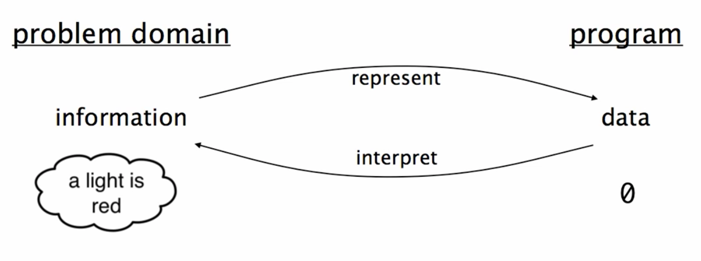
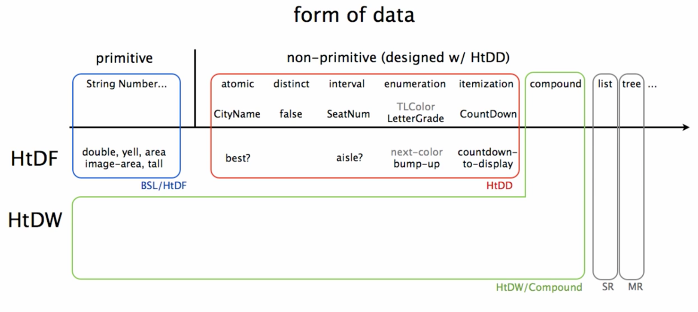

# How to Design Data
## Module Overview
Процесс проектирования данных в программе рулит процессом проектирования функций. Хотя функций может быть больше, все они завязаны на те данные, с которыми они работают. **Данные управляют работой функций**. В процессе проектирования данных мы влияем на функции, которые будут этими данными пользоваться.

> And what we're going to see is that the design of data really turns out to be a **point of leverage** (точка опоры) in designing programs.

Learning Goals:

- Be able to use the How to Design Data Definitions (HtDD) recipe to design data definitions for atomic data.
- Be able to identify problem domain information that should be represented as simple atomic data, intervals, enumerations, itemizations and mixed data itemizations.
- Be able to use the Data Driven Templates recipe to generate templates for functions operating on atomic data.
- Be able to use the How to Design Functions (HtDF) recipe to design functions operating on atomic data.


## `cond` Expressions
`cond` упрощает написание условий, когда исходов больше, чем 2 (`if` обрабатывает только два) и эти _исходы равнозначны_.

> `cond` — multi-armed conditional.

Синтаксис:

```scheme
(cond [Q A]
      [Q A]
      [Q A]
      ; ...
      [else A])
```

:::tip Стиль кода
В Лиспе скобочки `()` и `[]` эквивалентны, но по соглашению в `cond` используют квадратные.
:::

`Q`uestion и `A`nswer — выражения. Вопросы `Q` должны быть предикатами (возвращать `Boolean`). В конце можно использовать `else`, чтобы обозначить ответ для всех прочих случаев.

Пример вычисления значения по модулю:

```scheme
(define (absval n)
  (cond [(> n 0) n]
        [(< n 0) (* -1 n)]
        [else 0]))
```

Пример дизайна функции с `cond`. Аннотации по HTDF-рецепту позволяют быстрее понять код:

```scheme
(require 2htdp/image)

(define I1 (rectangle 10 20 "solid" "red"))
(define I2 (rectangle 20 20 "solid" "red"))
(define I3 (rectangle 20 10 "solid" "red"))


;; Image -> String
;; produce shape of image, one of "tall", "square" or "wide"
(check-expect (aspect-ratio I1) "tall")
(check-expect (aspect-ratio I2) "square")
(check-expect (aspect-ratio I3) "wide")

;(define (aspect-ratio img) "")  ;stub

;(define (aspect-ratio img)      ;template
;  (... img))

(define (aspect-ratio img)  
  (cond [(> (image-height img) (image-width img)) "tall"]
        [(< (image-height img) (image-width img)) "wide"]
        [else "square"]))
```

С `if` эта же функция выглядела бы гораздо запутаннее:

```scheme
(define (aspect-ratio img)  
  (if (> (image-height img) (image-width img))
      "tall"
      (if (= (image-height img) (image-width img)) ; второе условие внутри
          "square"                                 ; отрицательной ветки первого
          "wide")))
```

Код с `if`, к тому же, нелогичный. Есть три равнозначных исхода: прямоугольник может быть узкий, равносторонний (квадрат) или широкий. В примере с `if` не видно равнозначности: второе условие вложено в `false`-вариант первого. В `cond` все случаи равнозначны и код получается проще и понятнее.

:::tip Блочный комментарий в Racket
Закоментить целый блок кода (выражение) можно, поставив на строке перед ним `#;`.
:::

## Data Definitions
Данные в коде программы представляет какую-то информацию из внешнего мира. Например, чтобы запрограммировать светофор нужно как-то обозначить цвета. У нас нет лампочек в программе, но есть символы: цифры, буквы и другие _данные_. Так, цвета светофора можно обозначить как `0`, `1` и `2` для красного, желтого и зеленого соответственно:



Определение данных (data definition) описывает следующее:

- как оформить данные нового типа;
- как представить информацию (красный, желтый, зеленый в светофоре) как данные (0, 1, 2) в коде;
- как интерпретировать данные в качестве информации;
- шаблон для работы с данными.

Определение данных упрощает функции:

- ограничивает набор данных, которые функция принимает и возвращает;
- помогает с примерами и шаблонами.

Пример определения типа данных `TLColor` — число от `0` до `2`, которое представляет цвет светофора:

```scheme
;; Data definitions:

;; TLColor is one of:
;;  - 0
;;  - 1
;;  - 2
;; interp. 0 means red, 1 yellow, 2 green               
#;
(define (fn-for-tlcolor c)
  (cond [(= c 0) (...)]
        [(= c 1) (...)]
        [(= c 2) (...)]))


;; Functions

;; TLColor -> TLColor
;; produce next color of traffic light
(check-expect (next-color 0) 2)
(check-expect (next-color 1) 0)
(check-expect (next-color 2) 1)

;(define (next-color c) 0)  ;stub

; Template from TLColor

(define (next-color c)
  (cond [(= c 0) 2]
        [(= c 1) 0]
        [(= c 2) 1]))
```

## Atomic Non-Distinct
A first example of using the How to Design Data (HtDD recipe) and Data Driven Templates recipes.

Non-distinct — не четкие. То есть не ограничены каким-то набором, любые.

Атомарные (примитивные, неделимые) данные — те, что не состоят из частей и принадлежат одной предметной области (problem domain). Например, названия городов:

<table style="width: 50%">
    <tr>
        <th>Information</th>
        <th>Data</th>
    </tr>
    <tr>
        <td>Vancouver</td>
        <td><code>"Vancouver"</code></td>
    </tr>
    <tr>
        <td>Boston</td>
        <td><code>"Boston"</code></td>
    </tr>
</table>

Пример использование HtDD и Data Driven Template:

```scheme
;; CityName is String
;; Interp. the name of a city
(define CN1 "Boston")
(define CN2 "Vancouver")
#;
(define (fn-for-city-name cn)
  (... cn))

;; Template rules used:
;; - atomic non-distinct: String
```

Мы получили не примитивный тип данных `CityName`.

## HtDF With Non-Primitive Data
Пример функции для типа `CityName`:

```scheme
;; CityName -> Boolean
;; Products true if the given city is "Taganrog"
(check-expect (best-city? "Moscow") false)
(check-expect (best-city? "Taganrog") true)
; (define (best-city? city) true)
; took template from CityName data definition
#;
(define (best-city? city)
  (... city))

(define (best-city? city)
  (string=? city "Taganrog"))
```

## HtDF X Structure of Data Orthogonality
Orthogonal means "mostly independent".

Рецепт HtDF не меняется при использовании разных типов данных. Изучив проектирование функций в прошлом разделе мы уже знаем все, что нужно для использования разных данных (атомарных, составных) в функциях:



## Interval
Интервал — числа в диапазоне от и до.

Пример: нужно задиайнить данные — номер места (кресла) в ряду в театре. Мест в ряду может быть от 1 до 32 (это информация, которую надо представить в виде данных в программе). Номер кресла — число в промежутке от 1 до 32. Это интервальный тип данных.

```scheme
;; SetNum is Integer[1, 32]
;; Interp. seat numbers in a row, 1 and 32 are aisle seats
(define SN1  1) ; aisle
(define SN2 12) ; middle  
(define SN3 32) ; aisle
#;
(define (fn-for-seat-num sn)
  (... sn))

;; Template rules used:
;;  - atomic non-distinct: Number[1, 32]
```

`Natural` — натурльное число. Это `Integer` от нуля и больше (положительное число).

- `[]` — включая.
- `()` — не включая

Например, в записи `[1, 32)` — 1 включается, а 32 — нет.

Нужен хотя бы один пример объявления данных. Если есть несколько интересных, например, места у прохода, то их тоже стоит добавить. Чем сложнее будет структура данных, тем нужнее и важнее будут примеры.

## Enumeration
Enumeration (перечисление) — тип данных, состоящий из фиксированного набора отличных друг-от-друга значений (два или более). Значения четко определены и не меняются (one of). Например, буквенная оценка успеваемости: A, B, C. Или цвета светофора: красный, желтый, зеленый.

Enumeration используются, когда предметная область состоит из четко определенного набора значений. Времена года, цвета светофора, месяцы в году и т. д.

В перечислении данные могут быть atomic distinct — неделимые, четко определенные, из какого-то списка. Например, одно из A, B или C:

```scheme
;; LetterGrade is one of:
;;  - "A"
;;  - "B"
;;  - "C"
;; Interp. the letter grade in a course
;; <examples are redundant for enumerations>
#; 
(define (fn-for-letter-grade lg)
  (cond [(string=? lg "A") (...)]
        [(string=? lg "B") (...)]
        [(string=? lg "C") (...)]))

;; Template rules used:
;;  - one of: 3 cases
;;  - atomic distinct value: "A"
;;  - atomic distinct value: "B"
;;  - atomic distinct value: "C"
```

Примеры в этом случае излишни. Потому что писать `зима means "зима"` или `red means "red"` излишне.

## Itemization
Не все перечисления содержать однотипные, неделимые (atomic distinct) значения. Иногда тип данных может содержать элементы различного рода. Для таких типов данных используется itemization.

Например:

> Consider designing the system for controlling a New Year's Eve
display. Design a data definition to represent the current state 
of the countdown, which falls into one of three categories: 
> 
> - not yet started
> - from 10 to 1 seconds before midnight
> - complete (Happy New Year!)

Использовать itemization нужно, когда предметная область включает 2 или более подкласса, как минимум один из которых — не является неделимым, отличным значением (не atomic distinct). (Two or more subclasses, and at least one is not atomic distinct).

Т.к. данные могут быть разных типов (булево, интервал, строка), то при выполнении операций нужно учитывать разные типы. Наприммер, не допускать сравнение для строк, только для цифр и т.п.

```scheme
;; CountDown is one of:
;;  - false
;;  - Natural[1, 10]
;;  - "complete"
;; Interp.
;;     false means countdown has not yet started
;;     Natural[1, 10] means countdown is running and how many seconds left
;;     "complete" means countdown is over
(define CD1 false)
(define CD2 10)    ; just started
(define CD3 1)     ; almost over
(define CD4 "complete")
#;
(define (fn-for-countdown c)
  (cond [(false? c) (...)]
        [(number? c) (... c)]
        [else (...)]))

;; Template rules used:
;;  - one of: 3 cases
;;  - atomic distinct: false
;;  - atomic non-distinct: Natural[1, 10]
;;  - atomic distinct: "complete"
```

### Упрощение кода (Itemization, pt 3):

1. Если вариант опреденного типа остался последний, то можно сделать только проверку на тип (`number?`). If a given subclass is the last subclass of its type, we can reduce the test to just the guard, ie `(number? c)`.
2. Если все оставшиеся варианты одного типа, то можно опустить проверку на тип. if all reamining sublcasses are of the same type, then we can eliminate all of the guards.

### Примеры из задачи
```scheme
;; TV volume level 1-30, or mute
;; TV volume level is one of:
;;  - Natural[1, 30]
;;  - "mute"

;; height of a rocket
;; RocketHeight is Natural

;; primary colors: red, green, blue
;; PrimaryColor is one of:
;;  - "red"
;;  - "green"
;;  - "blue"

;; percentage score
;; PercentageScore is Number[0, 100]
```

## HtDF with Interval
Пример с `aisle?` и `middle?`.

## HtDF with Enumeration
Пример `bump-up`, возвращающий следующую оценку.

## HtDF with Itemization
