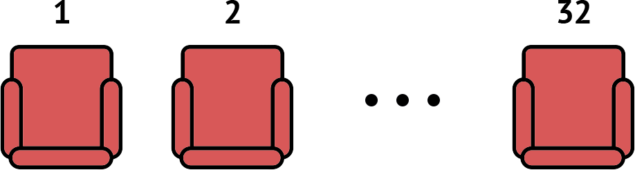

# How to Design Data
## Module Overview
Процесс проектирования данных в программе рулит процессом проектирования функций. Хотя функций может быть больше, все они завязаны на те данные, с которыми они работают. **Данные управляют работой функций**. В процессе проектирования данных мы влияем на функции, которые будут этими данными пользоваться.

> And what we're going to see is that the design of data really turns out to be a **point of leverage** (точка опоры) in designing programs.

Learning Goals:

- Be able to use the How to Design Data Definitions (HtDD) recipe to design data definitions for atomic data.
- Be able to identify problem domain information that should be represented as simple atomic data, intervals, enumerations, itemizations and mixed data itemizations.
- Be able to use the Data Driven Templates recipe to generate templates for functions operating on atomic data.
- Be able to use the How to Design Functions (HtDF) recipe to design functions operating on atomic data.

## `cond` Expressions
`cond` упрощает написание условий, когда исходов больше, чем 2 (`if` обрабатывает только два) и эти _исходы равнозначны_.

> `cond` — multi-armed conditional.

Синтаксис:

```scheme
(cond [Q A]
      [Q A]
      [Q A]
      ; ...
      [else A])
```

:::tip Стиль кода
В Лиспе скобочки `()` и `[]` эквивалентны, но по соглашению в `cond` используют квадратные.
:::

`Q`uestion и `A`nswer — выражения. Вопросы `Q` должны быть предикатами (возвращать `Boolean`). В конце можно использовать `else`, чтобы обозначить ответ для всех прочих случаев.

Пример вычисления значения по модулю:

```scheme
(define (absval n)
  (cond [(> n 0) n]
        [(< n 0) (* -1 n)]
        [else 0]))
```

Пример дизайна функции с `cond`. Аннотации по HTDF-рецепту позволяют быстрее понять код:

```scheme
(require 2htdp/image)

(define I1 (rectangle 10 20 "solid" "red"))
(define I2 (rectangle 20 20 "solid" "red"))
(define I3 (rectangle 20 10 "solid" "red"))


;; Image -> String
;; produce shape of image, one of "tall", "square" or "wide"
(check-expect (aspect-ratio I1) "tall")
(check-expect (aspect-ratio I2) "square")
(check-expect (aspect-ratio I3) "wide")

;(define (aspect-ratio img) "")  ;stub

;(define (aspect-ratio img)      ;template
;  (... img))

(define (aspect-ratio img)  
  (cond [(> (image-height img) (image-width img)) "tall"]
        [(< (image-height img) (image-width img)) "wide"]
        [else "square"]))
```

С `if` эта же функция выглядела бы гораздо запутаннее:

```scheme
(define (aspect-ratio img)  
  (if (> (image-height img) (image-width img))
      "tall"
      (if (= (image-height img) (image-width img)) ; второе условие внутри
          "square"                                 ; отрицательной ветки первого
          "wide")))
```

Код с `if`, к тому же, нелогичный. Есть три равнозначных исхода: прямоугольник может быть узкий, равносторонний (квадрат) или широкий. В примере с `if` не видно равнозначности: второе условие вложено в `false`-вариант первого. В `cond` все случаи равнозначны и код получается проще и понятнее.

:::tip Блочный комментарий в Racket
Закоментить целый блок кода (выражение) можно, поставив на строке перед ним `#;`.
:::

## Data Definitions
Данные в коде программы представляет какую-то информацию из внешнего мира.


> Data definitions explain how information is represented as data. This is a crucial part of program design and has a significant effect on the design of every function that operates on that data.

Например, чтобы запрограммировать светофор, нужно как-то обозначить цвета. У нас нет лампочек в программе, но есть данные: цифры, буквы и пр. Таким образом, цвета светофора можно обозначить как `0`, `1` и `2` для красного, желтого и зеленого соответственно.

Определение данных (data definition) описывает следующее:

- как оформить данные нового типа;
- как представить информацию из внешнего мира (красный, желтый, зеленый в светофоре) в виде данных в коде программы (0, 1, 2);
- как интерпретировать данные из программы в виде информации из внешнего мира;
- шаблон для работы с данными.

Определение данных упрощает функции:

- ограничивает набор данных, которые функция принимает и возвращает;
- помогает с примерами и шаблонами.

<a name="tl-example"></a>Пример определения типа данных `TLColor` — число от `0` до `2`, которое представляет цвет светофора:

```scheme
;; Data definitions

;; TLColor is one of:                      ; type comment
;;  - 0
;;  - 1
;;  - 2
;; interp. 0 means red, 1 yellow, 2 green  ; interpretation
#;
(define (fn-for-tlcolor c)                 ; template for one-argument function
  (cond [(= c 0) (...)]                    ; that consume data of this argument
        [(= c 1) (...)]
        [(= c 2) (...)]))


;; Functions

;; TLColor -> TLColor
;; produce next color of traffic light
(check-expect (next-color 0) 2)
(check-expect (next-color 1) 0)
(check-expect (next-color 2) 1)

;(define (next-color c) 0)  ;stub

; Template from TLColor

(define (next-color c)
  (cond [(= c 0) 2]         ; red -> green
        [(= c 2) 1]         ; green -> yellow
        [(= c 1) 0]))       ; yellow -> red
```

Смоделировали такой светофор:


## Atomic Non-Distinct
> A first example of using the How to Design Data (HtDD recipe) and Data Driven Templates recipes.

Атомарные (примитивные, неделимые) данные — те, что не состоят из частей и принадлежат одной предметной области (problem domain). Их нелзя разделить на части и сохранить при этом смысл (нельзя взять отдельную букву из названия города, в этом нет смысла).

Non-distinct — не четкие. То есть не ограничены каким-то набором, любые.

Например, названия городов:

<table style="width: 50%">
    <tr>
        <th>Information</th>
        <th>Data</th>
    </tr>
    <tr>
        <td>Vancouver</td>
        <td><code>"Vancouver"</code></td>
    </tr>
    <tr>
        <td>Boston</td>
        <td><code>"Boston"</code></td>
    </tr>
</table>

Пример использование HtDD и Data Driven Template:

```scheme
;; CityName is String
;; Interp. the name of a city
(define CN1 "Boston")
(define CN2 "Vancouver")
#;
(define (fn-for-city-name cn)
  (... cn))

;; Template rules used:
;; - atomic non-distinct: String
```

Мы получили не примитивный тип данных `CityName`.

## HtDF With Non-Primitive Data
Пример функции для типа `CityName`:

```scheme
;; CityName -> Boolean
;; Products true if the given city is "Taganrog"
(check-expect (best-city? "Moscow") false)
(check-expect (best-city? "Taganrog") true)
; (define (best-city? city) true)
; took template from CityName data definition
#;
(define (best-city? city)
  (... city))

(define (best-city? city)
  (string=? city "Taganrog"))
```

Функции-предикаты в Лиспах принято оканчивать знаком `?`: `best-city?`.

## HtDF X Structure of Data Orthogonality
> Orthogonal means "mostly independent".

Рецепт HtDF не меняется при использовании разных типов данных. Изучив проектирование функций в прошлом разделе мы уже знаем все, что нужно для использования разных данных (атомарных, составных) в функциях:


> HtDF works nearly the same way for all forms of data. This has a significant impact on how quickly we can expand our design abilities, because once we learn a new form of data we already mostly know how to design functions that operate on it.

В таком подходе данные отделены от функций, которые их обрабатывают (функциональный подход).

## Interval
Интервал — числа в диапазоне от и до.

Пример: нужно задиайнить данные — номер места (кресла) в ряду в театре. Мест в ряду может быть от 1 до 32 (это информация, которую надо представить в виде данных в программе):



Номер кресла — интервальный тип данных (число в промежутке от 1 до 32, включая оба значения).

```scheme
;; SetNum is Integer[1, 32]
;; Interp. seat numbers in a row, 1 and 32 are aisle seats
(define SN1  1) ; aisle
(define SN2 16) ; middle  
(define SN3 32) ; aisle
#;
(define (fn-for-seat-num sn)
  (... sn))

;; Template rules used:
;;  - atomic non-distinct: Number[1, 32]
```

`Natural` — натуральное число. Это `Integer` от нуля и больше (положительное число).

- `[]` — включая.
- `()` — не включая

Например, в интервале `[1, 32]` 1 и 32 включаются, а в интервале `[1, 33)` — 1 включается, 33 — нет.

Нужен хотя бы один пример объявления данных. Если есть несколько интересных, например, места у прохода (aisle), то их тоже стоит добавить. Чем сложнее будет структура данных, тем нужнее и важнее будут примеры.

## Enumeration
Enumeration (перечисление) — тип данных, состоящий из фиксированного набора значений, отличных друг-от-друга. Значений должно быть два или более. Они четко определены и не меняются (one of). Например, буквенная оценка успеваемости: A, B, C. Или цвета светофора из <a href="#tl-example">примера выше</a>: красный, желтый, зеленый.

Enumeration используются, когда предметная область состоит из четко определенного набора значений. Времена года, цвета светофора, месяцы в году и т.д.

В перечислении данные могут быть Atomic Distinct — неделимые, четко определенные (из какого-то набора значений). Значения из набора — подклассы (subclasses) данных. Например, одно из A, B или C:

```scheme
;; LetterGrade is one of:
;;  - "A"
;;  - "B"
;;  - "C"
;; Interp. the letter grade in a course
;; <examples are redundant for enumerations>
#; 
(define (fn-for-letter-grade lg)
  (cond [(string=? lg "A") (...)]
        [(string=? lg "B") (...)]
        [(string=? lg "C") (...)]))

;; Template rules used:
;;  - one of: 3 cases
;;  - atomic distinct value: "A"
;;  - atomic distinct value: "B"
;;  - atomic distinct value: "C"
```

Примеры в этом случае излишни. Потому что писать `зима means "зима"` или `red means "red"` излишне.

## Itemization
Не все перечисления содержат однотипные, неделимые (atomic distinct) значения. Иногда тип данных может содержать элементы различного рода. Для таких типов данных используется Itemization.

Например:

> Consider designing the system for controlling a New Year's Eve
display. Design a data definition to represent the current state 
of the countdown, which falls into one of three categories: 
> 
> - not yet started
> - from 10 to 1 seconds before midnight
> - complete (Happy New Year!)

Itemization используют, когда предметная область включает 2 или более подкласса и как минимум один из них не является неделимым, отличным значением:

> Two or more subclasses, and at least one is not atomic distinct.

Т.к. данные могут быть разных типов (булево, интервал, строка), то при выполнении операций нужно учитывать разные типы. Например, не допускать сравнение для строк, только для цифр и т.п.

```scheme
;; CountDown is one of:
;;  - false
;;  - Natural[1, 10]
;;  - "complete"
;; Interp.
;;     false means countdown has not yet started
;;     Natural[1, 10] means countdown is running and how many seconds left
;;     "complete" means countdown is over
(define CD1 false)
(define CD2 10)    ; just started
(define CD3 1)     ; almost over
(define CD4 "complete")
#;
(define (fn-for-countdown c)
  (cond [(false? c) (...)]
        [(number? c) (... c)]
        [else (...)]))

;; Template rules used:
;; - one of: 3 cases
;; - atomic distinct: false
;; - atomic non-distinct: Natural[1, 10]
;; - atomic distinct: "complete"
```

### Упрощение кода (Itemization, pt 3):

1. Если вариант опреденного типа остался последний, то можно сделать только проверку на тип (`number?`). If a given subclass is the last subclass of its type, we can reduce the test to just the guard, ie `(number? c)`.
2. Если все оставшиеся варианты одного типа, то можно опустить проверку на тип. if all reamining sublcasses are of the same type, then we can eliminate all of the guards.

### Примеры из задачи
```scheme
;; TV volume level 1-30, or mute
;; TV volume level is one of:
;;  - Natural[1, 30]
;;  - "mute"

;; height of a rocket
;; RocketHeight is Natural

;; primary colors: red, green, blue
;; PrimaryColor is one of:
;;  - "red"
;;  - "green"
;;  - "blue"

;; percentage score
;; PercentageScore is Number[0, 100]
```

## HtDF with Interval
HtDF-рецепт _почти_ не зависит от данных (mostly orthogonal). Почти, потому что описание данных дает представление о том, сколько тестов нам надо написать по рецепту для определения функций.

Например, возьмем функцию, которая принимает номер кресла в ряду и возвращает `true`, если место с краю (aisle).

По рецепту для создания данных для интервалов нужно [написать тесты](https://courses.edx.org/courses/course-v1:UBCx+HtC1x+2T2017/77860a93562d40bda45e452ea064998b/#Interval) для граничных значений и значения откуда-то из середины.

```scheme
;; SeatNum -> Boolean
;; produces true if the given number is on the aisle
(check-expect (aisle?  1) true)
(check-expect (aisle? 16) false)
(check-expect (aisle? 32) true)

;; (define (aisle? sn) false) ; stub

;; <use template from SeatNum>
(define (aisle? sn)
  (or (= sn 1) (= sn 32)))
```

Создавая функцию, которая оперирует с <a href="#interval">созданным ранее типом данных</a> мы полагаемся на этот тип. То есть писать тест для номера кресла 33 нет смысла, тип данных определен только на промежутке от 1 до 32:

```scheme
(check-expect (aisle? 33) false) ; бессмысленный тест
                                 ; 33 не является SeatNum
```

## HtDF with Enumeration
Для функции, которая работает с типом данных Enumeration [тесты](https://courses.edx.org/courses/course-v1:UBCx+HtC1x+2T2017/77860a93562d40bda45e452ea064998b/#Enumeration) нужны для всех возможных значений.

Пример: функция `bump-up` возвращает следующую высшую оценку (A — самая высокая):

```scheme
;; LetterGrade -> LetterGrade
;; produces next highest letter grade (no change for A)
(check-expect (bump-up "A") "A")
(check-expect (bump-up "B") "A")
(check-expect (bump-up "C") "B")

;; (define (bump-up lg) "A")   ; stub
;; <use template from LetterGrade>

(define (bump-up lg)
  (cond [(string=? lg "A") "A"]
        [(string=? lg "B") "A"]
        [(string=? lg "C") "B"]))
```

Так как шаблон (template) мы используем из <a href="#enumeration">определения типа данных</a>, нужно следить за его валидностью, чтобы там все было без ошибок. Иначе для каждой функции из типа данных будем копировать кривой шаблон.

## HtDF with Itemization
Показать картинку текущего состояния в <a href="#itemization">отсчете</a> до нового года:

```scheme
;; Countdown->Image
;; produce image of current state of countdown
(check-expect (countdown->image false) (square 0 "solid" "white"))
(check-expect (countdown->image 5) (text (number->string 5) 24 "black"))
(check-expect (countdown->image "complete") (text "Happy New Year!" 24 "red"))

; (define (countdown->image c) (square 0 "solid" "white")) ; stub
; <use template from Countdown>
(define (countdown->image c)
  (cond [(false? c) (square 0 "solid" "white")]
        [(and (number? c) (<= 1 c) (<= c 10))
         (text (number->string c) 24 "black")]
        [else (text "Happy New Year!" 24 "red")]))
```

Тесты нужны для каждого кейса.

Функции, конвертирующие данные из одного формата в другой в Racket принято разделять стрелками: `number->string`, `countdown->image` etc.

## Structure of Information Flows Through
> Identifying the structure of the information is really a key step in the program design.

Во многих случаях, для многих программ информация определяет данные, а данные определяют функции (шаблон, тесты). Data Driven Approach.

Ещё примеры типов:

- Группа крови — Enumeration.
- Количество девочек в группе численностью 50 человек — Interval.
- Сериал, который или закрыт или идет по какому-то каналу — Itemization.
- Название универа в Канаде — Simple Atomic.
- Скорость автомобиля до 200 км/ч — Interval.
- Континенты — Enumeration.

