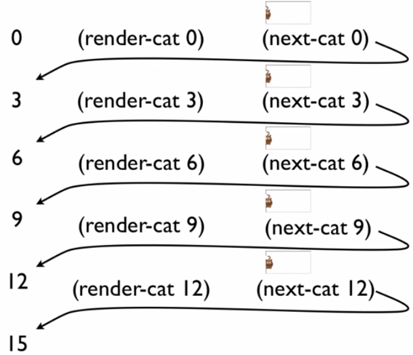
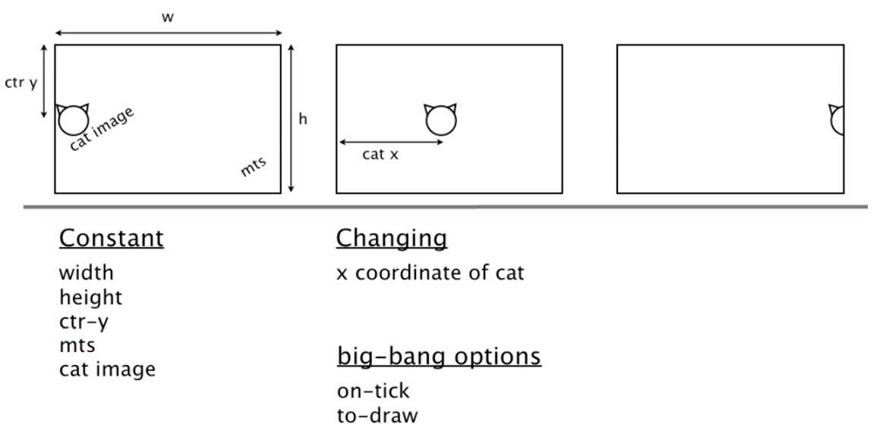

# 3a: How to Design Worlds
## Module Overview
В этом модуле будет рассмотрен рецепт HtDW для создания интерактивных программ в DrRacket. Будут использованы более сложные определения данных и встроенный функционал для создания интерактивных приложений с графикой.

## Interactive Programs
Будем делать небольшие интерактивные графические приложения и однострочный текстовый редактор, похожий на поле для отправки СМС в телефоне.

## The big-bang Mechanism (all parts)
MTS (eMpTy Scene) — холст, на котором размещаются графические интерактивные объекты (белый прямоугольник, по которому двигается кот).

CTR-Y — CenTeR Y — координата по оси ординат.

[`place-image`](https://docs.racket-lang.org/teachpack/2htdpimage.html#%28def._%28%28lib._2htdp%2Fimage..rkt%29._place-image%29%29) размещает одну картинку внутри другой (MTS).

Чтобы показать перемещающегося слева-направо кота, нужно постепенно увеличивать его координату `X`, смещать картинку, снова увеличивать координату `X`, снова смещать картину и так далее:



Для таких действий в Racket есть конструкция [`big-bang`](https://docs.racket-lang.org/teachpack/2htdpuniverse.html?q=big-bang#%28form._world._%28%28lib._2htdp%2Funiverse..rkt%29._big-bang%29%29) — выражение, с помощью которого можно рендерить интерактивные штуки.

```scheme
(big-bang 0               ; начальное состояние, первая позиция кота
    (on-tick next-cat)    ; ф-я возвращает следующую координату X
    (to-draw render-cat)) ; ф-я рисует кота с заданными координатами
```

То есть функция `big-bang`, как и сам Большой взрыв, отвечает за создание мира и меняет его состояние.

`big-bang` — UI Framework — полиморфная функция, которая может принимать разные аргументы: списки, числа и пр. типы пользователя. Главное, чтобы аргументы были одного типа:

```scheme
(big-bang 0               ; X
    (on-tick next-cat)    ; X->X
    (to-draw render-cat)) ; X->Image
```

## Domain Analysis
Domain Analysis — анализ предметной области:

> The first phase of the How to Design Worlds (HtDW) recipe is to analyze the problem to identify _constant_ information, _changing_ information and required `big-bang` _options_.

Сперва нужно провести анализ (на бумажке), чтобы понять, из чего будет состоять наш мир. И уже потом реализовывать программу. Две фазы, они обозначены в [рецепте HtDW](https://courses.edx.org/courses/course-v1:UBCx+HtC1x+2T2017/77860a93562d40bda45e452ea064998b/#HtDW).

Domain analysis — первая фаза (use a piece of paper!):

1. Sketch program scenarios.
2. Identify constant information.
3. Identify changing information.
4. Identify big-bang options.



## Program through main Function
После анализа предметной области мы получили пачку констант, переменных и методов, которые нужно будет применить для создания и функционирования мира. После этого можно приступать к коду — второму шагу в [рецепте HtDW](https://courses.edx.org/courses/course-v1:UBCx+HtC1x+2T2017/77860a93562d40bda45e452ea064998b/#HtDW).

Build the actual program:

1. Constants (based on 1.2 above)
2. Data definitions using HtDD (based on 1.3 above)
3. Functions using HtDF:
    1. main first (based on 1.3, 1.4 and 2.2 above)
    2. wish list entries for `big-bang` handlers
4. Work through wish list until done

> Traceability: the ability to see where each element winds up in the resulting program.

Traceability — отслеживаемость. Как данные из анализа на первом шаге представлены в коде на шаге 2.

Почему важно создавать константы и не использовать значения явно (`HEIGHT / 2` вместо `200`):

> There's program that the change and programs that nobody uses.

Программа будет меняться. Когда есть константы и переменные, то менять программу проще.

В [рецепте](https://courses.edx.org/courses/course-v1:UBCx+HtC1x+2T2017/77860a93562d40bda45e452ea064998b/#HtDW) есть шаблон программы. В разделе с определением данных `WS` — это World State (состояние мира).

## Working through the Wish List
Меткой `!!!` в шаблоне отмечены места, к которым нужно вернуться позже и заполнить.

По рецепту, пункт 2.4 (Work through wish list until done) говорит, что нужно просто пройтись по всем `!!!` и заменить их тем, что нужно, используя HtDF-рецепт.

Шаблон и рецепты позволяют в каждый момент времени делать одну задачу, получая в итоге целую программу.

> The big benefit of having a systematic process is it lets you work on one thing at a time and know that it's all going to work out.

Некоторые части процесса не заметны в итоговой программе: анализ предметной области, шаблон программы. Тем не менее, это важные шаги, которые подводят нас к результату:

> People who design _design methods_, so that's a kind of meta-design, that's one of the things they work on is, how can there be elements of the design that get you there even though they disappear in the final artifact?

## Improving a World Program - Add SPEED
Задача: нужно иметь возможность задавать скорость.

Анализ предметной области — это модель программы, которая в общих чертах описывает её структуру. Анализ предметной области — план реализации программы.

Программы постоянно меняются. Хорошие программы позволяют менять/дополнять код без особых затруднений. Этому способствует грамотный анализ (подготовка модели) и четкое соответствие модели и её представления в виде кода.

Добавлять новую фичу (например, скорость перемещения кота) нужно также с анализа. К уже существующим константам добавляется новая — `SPEED`. И нужно также изменить функцию, которая перемещает кота слева-направо.

## Improving a World Program - Add key handler
Задача: при клике на пробел кот должен возвращаться к левому краю (в начало отсчета).

Снова возвращаемся к анализу. Констант добавлять не надо, модифицировать существующие функции тоже. Появляется новый параметр в функции `big-bang` — `on-key`:

```scheme
(big-bang ws)
    ; ...
    (on-key    ...)) ; Cat KeyEvent -> Cat
```

[`KeyEvent`](https://docs.racket-lang.org/teachpack/2htdpuniverse.html#%28tech._world._keyevent%29) в Racket — large enumeration. Может принимать значения для всех кнопок на клавиатуре.

Тип `KeyEvent` может принимать очень много значений, для всех тесты писать нет смысла, как это делается по рецепту для обычных [Enumerations](/2_htdd/#enumeration). Шаблон для этого типа такой (он есть [в рецептах](https://courses.edx.org/courses/course-v1:UBCx+HtC1x+2T2017/77860a93562d40bda45e452ea064998b/#HtDW)):

```scheme
(define (handle-key ws ke)
  (cond [(key=? ke " ") (... ws)]
        [else 
         (... ws)]))
```

Здесь мы обрабатываем только нужные кейсы и запихиваем остальное в `else`.

Для таких случаев можно писать white-box тесты: проверяем только те кейсы, которые непосредственно используем в программе (нажатие пробела). Для остальных кнопок достаточно одного примера на случай (когда `c` равно `0` или когда `c` равно `10` в нашем случае).

```scheme
;; Cat KeyEvent -> Cat
;; reset cat to left edge when space key is pressed
(check-expect (handle-key 10 " ") 0)
(check-expect (handle-key 10 "a") 10)
(check-expect (handle-key  0 " ") 0)
(check-expect (handle-key  0 "a") 0)
;(define (handle-key c ke) 0) ; stub

(define (handle-key c ke)
  (cond [(key=? ke " ") 0]
        [else c]))
```

## Программа целиком

```scheme
; PROBLEM:
; 
; Use the How to Design Worlds recipe to design an interactive
; program in which a cat starts at the left edge of the display 
; and then walks across the screen to the right. When the cat
; reaches the right edge it should just keep going right off 
; the screen.
; 
; Once your design is complete revise it to add a new feature,
; which is that pressing the space key should cause the cat to
; go back to the left edge of the screen. When you do this, go
; all the way back to your domain analysis and incorporate the
; new feature.
; 
; To help you get started, here is a picture of a cat, which we
; have taken from the 2nd edition of the How to Design Programs 
; book on which this course is based.
; 
; !!! Replace emoji 🐱 with graphics in DrRacket !!!
; 

(require 2htdp/image)
(require 2htdp/universe)

;; A cat that walks from left to right across the screen


;; =================
;; Constants:
(define WIDTH 600)
(define HEIGHT 400)
(define CTR-Y (/ HEIGHT 2))
(define MTS (empty-scene WIDTH HEIGHT))
(define SPEED 3)
(define CAT-IMG 🐱)


;; =================
;; Data definitions:

;; Cat is Number
;; Interp. x position of the cat in screen coordinates
(define C1 0)           ; left edge
(define C2 (/ WIDTH 2)) ; middle
(define C3 WIDTH)       ; right edge
;#
(define (fn-for-cat c)
  (... c))
;; Template rules used:
;; - atomic non-distinct: Number


;; =================
;; Functions:

;; Cat -> Cat
;; start the world with (main 0)
;; 
(define (main c)
  (big-bang c                       ; Cat
            (on-tick advance-cat)   ; Cat -> Cat
            (on-key handle-key)     ; Cat KeyEvent -> Cat
            (on-mouse handle-mouse) ; Cat Integer Integer MouseEvent -> Cat
            (to-draw render)))      ; Cat -> Image


;; Cat -> Cat
;; produce the next cat by advancing it SPEED pixels to right
(check-expect (advance-cat 0) SPEED)
;(define (advance-cat c) 0) ;stub
; <use template from Cat>
(define (advance-cat c)
  (+ c SPEED))


;; Cat -> Image
;; render the cat image at appropriate place on MTS
(check-expect (render 0)
              (place-image CAT-IMG 0 CTR-Y MTS))
;(define (render c) MTS) ; sub
; <use template from Cat>
(define (render c)
  (place-image CAT-IMG c CTR-Y MTS))


;; Cat KeyEvent -> Cat
;; reset cat to left edge when space key is pressed
(check-expect (handle-key 10 " ") 0)
(check-expect (handle-key 10 "a") 10)
(check-expect (handle-key  0 " ") 0)
(check-expect (handle-key  0 "a") 0)
;(define (handle-key c ke) 0) ; stub
(define (handle-key c ke)
  (cond [(key=? ke " ") 0]
        [else c]))


;; Cat Integer Integer MouseEvent -> Cat
;; set cat left position to the current exposition of the mouse
(check-expect (handle-mouse 10 50 CTR-Y "button-down") 50)
(check-expect (handle-mouse 10 50 CTR-Y "move") 10)
;(define (handle-mouse c x y me) 0) ; stub
(define (handle-mouse c x y me)
  (cond [(mouse=? me "button-down") x]
        [else c]))
```